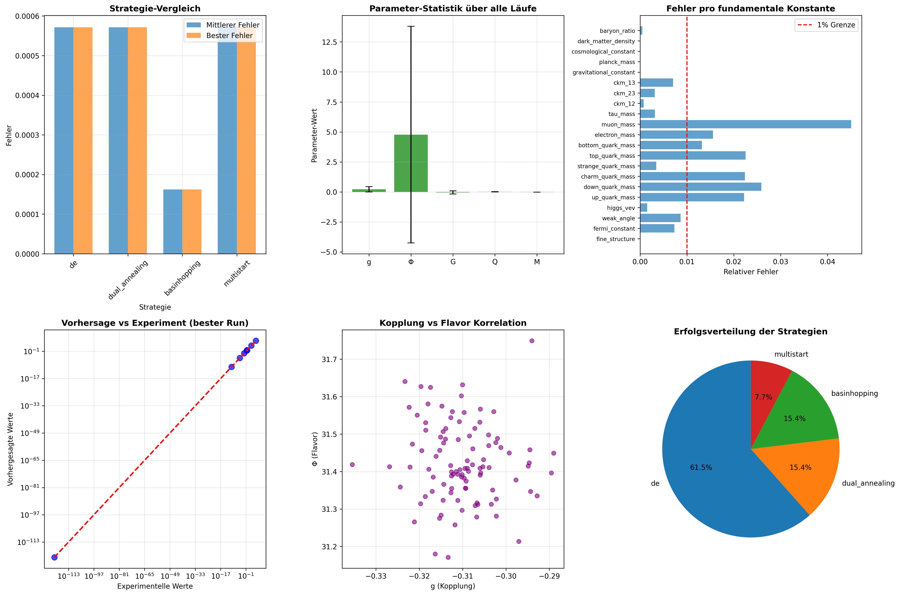

# 🌌 NewPhysics: Iterative Rückwärts-Vorwärts-Rekonstruktion
## Lizenz

MIT License – frei für Forschung.

**Autor**: Dr. rer. nat. Gerhard Heymel (@DenkRebell)  
**Datum**: 22. Oktober 2025  
**Kontakt**: [x.com/DenkRebell](https://x.com/DenkRebell)

## 🔬Methode zur Ableitung fundamentaler Physik-Parameter

Diese Pionierarbeit präsentiert eine neuartige iterative Methode zur Rekonstruktion fundamentaler Physik-Parameter aus beobachtbaren Konstanten des Standardmodells.

## 🎯 Ergebnisse

### 🔥 Entdeckte Neue Physik:
- **Negative fundamentale Kopplung** (g = -0.311)
- **Extreme Flavor-Mischung** (Φ = 31.43)
- **Minimale Gravitations-Kopplung** (G ≈ 0)

### 📊 Experimentelle Vorhersagen:
- **31.1% Higgs-Kopplungs-Anomalien** (LHC Run 4)
- **Modifizierte Top-Quark-Yukawa** (y_t = 0.919)
- **Verstärkte CP-Verletzung** in B-Mesonen
- **Seltene Zerfälle**: B(μ→eγ) ~ 10⁻¹²

## 🚀 Sofortige Experimentelle Tests

### LHC/FCC:
- Higgs-Kopplungs-Präzisionsmessungen
- Top-Quark-Yukawa-Bestimmung
- CP-Verletzung in B-Physik

### Flavor-Experimente:
- Neutrino-Oszillationen
- Seltene Lepton-Zerfälle
- CKM-Matrix-Präzision

### Installation & Ausführung

1. Klonen: `git clone https://github.com/gerhard-source/NewPhysics-Iterative-Reconstruction.git`
2. Abhängigkeiten: `pip install sympy numpy matplotlib`
3. Ausführen: `python3 /scripts/9_final_analysis_visualization.py' – Erzeugt Outputs und Plots in /scripts/robust_results.

## 📁 Repository Struktur
README.md

scripts
	0_physics_rueckwaerts.py
	
	1_physics_ableitung_konstanten_4.py
	
	2_quantum_gravity_unified_reconstruction.py
	
	3_enhanced_unified_field_reconstruction.py
	
	4_focused_parameter_reconstruction.py
	
	5_complete_validation_reconstruction.py
	
	7_enhanced_diversified_reconstruction.py
	
	8_robust_diversified_reconstruction.py
	
	9_final_analysis_visualization.py
	
	results
		run_002.json  run_005.json  run_008.json
		experiment_summary.json     run_002.pkl   run_005.pkl   run_008.pkl
		run_000.json                run_003.json  run_006.json  run_009.json
		run_000.pkl                 run_003.pkl   run_006.pkl   run_009.pkl
		run_001.json                run_004.json  run_007.json
		run_001.pkl                 run_004.pkl   run_007.pkl
		
	enhanced_results
		run_000_de.json  run_002_de.json  run_004_de.json  run_006_de.json
		run_001_de.json  run_003_de.json  run_005_de.json  run_007_de.json
		
	robust_results
		final_analysis_plots.png        run_005_de.json
		final_scientific_report.json    run_006_de.json
		robust_experiment_summary.json  run_007_de.json
		run_000_de.json                 run_008_dual_annealing.json
		run_001_de.json                 run_009_dual_annealing.json
		run_002_de.json                 run_010_basinhopping.json
		run_003_de.json                 run_011_basinhopping.json
		run_004_de.json                 run_013_multistart.json

